# Práctica 2. Tratamiento de imágenes básico

Consulta esta documentación [en GitHub](https://github.com/) para ver correctamente las imágenes.

## Pre-requisitos

1. Clona este repositorio en tu ordenador usando GitHub Desktop.
2. Despliega la lista de repositorios pinchando en el botón *Current repository* y pincha con el botón derecho sobre el repositorio que acabas de clonar.  En el menú contextual selecciona *Open in Command Prompt*. Instala las dependencias ejecutando la siguiente orden:
```
pip install -r requirements.txt
```

## Imágenes como matrices

En Python, como en Matlab, se pueden leer las imágenes gráficas como si se tratara de simples matrices.  Para ello se usa la biblioteca `imageio`.  Por ejemplo:

```python
from imageio import imread, imwrite
img = imread('https://uclm-mantis.github.io/mantissym.png')
```

Con ese sencillo trozo de código `img` es un array (una matriz) tridimensional con todos los datos de la imagen.  No se trata de ninguno de los tipos de datos de Python que hemos visto. Se trata de una matriz de `numpy`, otra bibliota muy popular para cálculo numérico con Python. La primera dimensión es el eje X, la segunda el eje Y y la tercera son las capas de color.  Dependiendo del formato de la imagen la tercera dimensión puede tener significados diferentes.

* En una imagen monocroma sin transparencia la tercera dimensión se colapsa en un único valor, que representa la intensidad de cada punto.  Es decir, las matrices de imágenes en escala de grises son simples matrices bidimensionales.
* En una imagen en color con transparencia la tercera dimensión corresponde a los valores de las componentes R (*red*), G (*green*), B (*blue*) y A (*alpha*).  Las componentes R,G,B determinan el color del punto y pueden contener valores entre 0 y 255. La componente A (*alpha*) mide el grado de transparencia del punto, donde 0 es transparente y 255 es completamente opaco.
* En una imagen en color sin transparencia la tercera dimensión solo tiene las componentes R, G, B.
* Existen otras posibilidades, pero no son interesantes en el contexto de esta práctica.

De forma totalmente análoga, se puede escribir una matriz en un archivo gráfico empleando `imwrite`.  El funcionamiento es similar a la de su homóloga en Matlab.

```python
imwrite('resultado.png', img)
```

Durante el desarrollo, es útil visualizar las imágenes, para lo que se puede usar la biblioteca `matplotlib.pyplot` como se muestra a continuación:

```python
from matplotlib.pyplot import imshow, figure, show
imshow(img)
figure()
imshow(img[:,::-1])
show()
```

El funcionamiento es similar al de la función del mismo nombre de Matlab.  Cada llamada a `imshow` encola una imagen para mostrarse en la ventana actual.  La llamada a `figure` crea una nueva ventana. La llamamada a `show` es un bucle sin fin para mostrar todas las ventanas encoladas. Puede llamarse varias veces a `imshow` y `figure` para ver diferentes imágenes, pero una sola vez a `show`.

### Indexación de las matrices

Las matrices de `numpy` tienen características similares a las matrices de Matlab, salvo porque se usan índices que empiezan en 0, en lugar de 1. Veamos algunos ejemplos:

```python
# poner un color determinado en un pixel de la imagen
x, y = 120, 30
img[x,y] = (255,0,0)

# intercambiar dos líneas
img[:,50] = img[:,100]

# separar la imagen en componentes r,g,b
r,g,b = img[:,:,0], img[:,:,1], img[:,:,2]

# poner al máximo la componente roja de una línea horizontal
img[:,y,0] = 255

# poner a cero la componente azul de un rectángulo
img[100:250,50:120,2] = 0
```

## Primer bloque de ejercicios de la práctica

El objetivo de este primer bloque es generar un archivo PNG a partir de otro archivo PNG en el que **se delimitan los objetos de la imagen** empleando cajas delimitadoras (*bounding boxes*).  Para simplificar, las imágenes tendrán fondo blanco, sin transparencia.  Se identificará como fondo exclusivamente los puntos que sean completamente blancos.  Es decir, los que tengan las componentes RGB como `(255, 255, 255)`. Lo destacamos porque es posible que la imagen tenga algunos puntos ligeramente grises u otros colores muy claros.  Por ejemplo, éste es uno de los tests y en rojo destacamos los puntos que realmente son blancos.

Original | Con el fondo destacado
---------|-----------------------
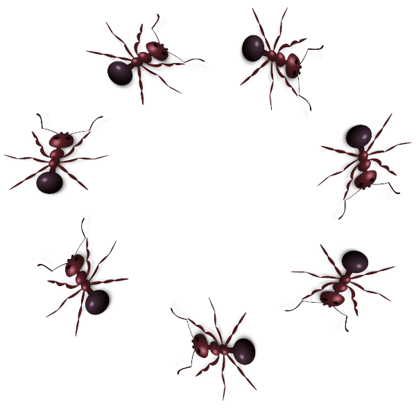 | 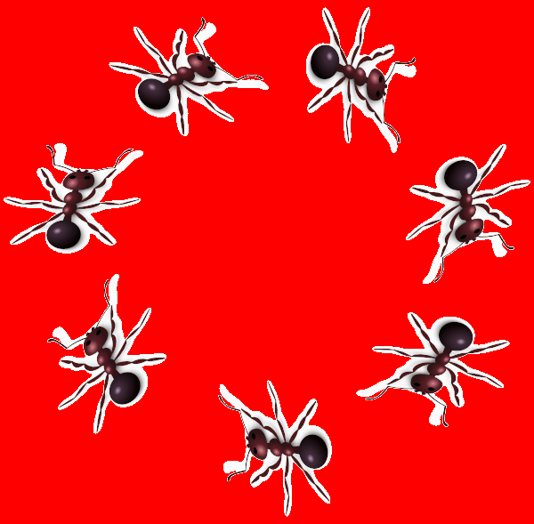

### 1. Obtener las cajas delimitadoras (*bounding boxes*)

Elaborar la función `get_bb` que recibe tres argumentos: una imagen en color sin transparencia, un rectángulo y un color. El rectángulo se expresa como una tupla con los cuatro números que corresponden a las coordenadas de las esquinas superior izquierda e inferior derecha respectivamente `(x1, y1, x2, y2)`. Delimita la zona donde se encuentra un único objeto en la imagen. El color representa el color de fondo. La función debe devolver otro rectángulo ajustado de manera que delimite con precisión el objeto.  Por ejemplo:

```python
>>> img = imread('img/ants.png')
>>> r = (100,0,300,160)
>>> get_bb(img, r, (255, 255, 255))
(122, 19, 300, 153)
```

El rectángulo debe ser el más pequeño que contiene todos los puntos del objeto correspondiente, es decir, todos los puntos que no son del color de fondo y están dentro del rectángulo. Se representa siguiendo el convenio habitual de Python, en el sentido de que las coordenadas de la esquina inferior derecha son una unidad superior a la última coordenada que pertenece al rectángulo.  Por ejemplo, en la imagen se muestra un rectángulo y su representación como tupla:

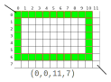

### 2. Dibujar un rectángulo en una imagen

Elaborar la función `draw_rect` que recibe tres argumentos del mismo tipo que en el ejercicio anterior.  La función debe dibujar en la imagen que recibe como primer argumento el rectángulo especificado como segundo argumento.  Para el dibujo debe emplear exclusivamente el color que se pasa como argumento. Devuelve la imagen modificada.

```python
>>> draw_rect(img, r, (0, 255, 0))
```

### 3. Resaltar un rectángulo en una imagen

Elaborar la función `hl_rect` que recibe tres argumentos del mismo tipo que el ejercicio anterior.  La función debe destacar (*highlight*) el rectángulo correspondiente sumando el color que se pasa como tercer argumento al color de cada punto del rectángulo, pero teniendo en cuenta que cada coordenada debe estar en el rango de 0 a 255.  Devuelve la imagen modificada.

```python
>>> hl_rect(img, r, (-50, 50, 50))
```

Observa cómo se pueden usar componentes negativas en el color que se pasa a la función `hl_rect` para conseguir degradar los colores claros.  Ten en cuenta que el resultado siempre debe truncarse al rango de valores válidos *[0,255]*.

Ejemplo de `draw_rect(img,r,(0,255,0))` | Ejemplo de `hl_rect(img,r,(-50,50,50))`
-----------------------|---------------------
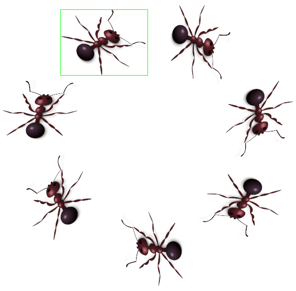 | 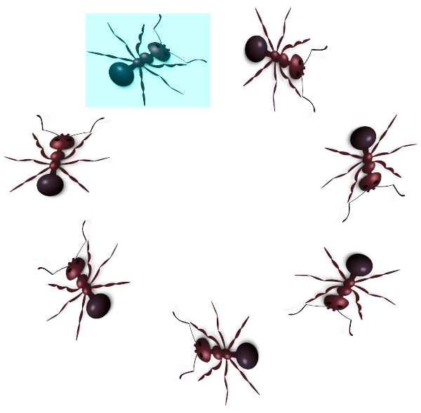

### 4. Resaltar los objetos de la imagen

Elaborar la función `find_bb` que recibe dos argumentos: una imagen en color sin transparencia, y una lista de rectángulos que determinan cada una de las áreas de la imagen donde se encuentran objetos.  La función debe destacar las cajas delimitadoras de los objetos con el color `(-50,-50,50)` y dibujar un rectángulo alrededor usando el color `(0,0,250)`.  Devuelve la imagen modificada.

```python
>>> hormigas = [
    (100,0,300,160),
    (310,0,500,180),
    (450,150,600,340),
    (0,150,170,300),
    (50,300,200,500),
    (400,340,600,490),
    (200,400,400,589)
]
>>> find_bb(img, hormigas)
```

### 5. Auto-recorte de imágenes

Elaborar la función `autocrop` que recibe como argumento una ruta de un archivo. La función debe determinar en primer lugar cuál es el color de fondo analizando la imagen y comprobando cuál el el color más repetido.  A continuación encontrará la caja delimitadora del dibujo y recortará la imagen para eliminar tanto fondo como sea posible sin perder nada del resto de la imagen.  Finalmente grabará el archivo con el mismo nombre, sobreescribiendo el original (*es una función impura*).

```python
>>> autocrop('img/ants.png')
```

Para ilustrar el resultado, en el ejemplo de la figura se destaca la parte de la imagen que es eliminada por `autocrop`. El efecto real debe ser el resultado de eliminar esa parte.

Ejemplo de `find_bb(img,hormigas)` | Ilustración de `autocrop('img/ants.png')`
-----------------------|---------------------
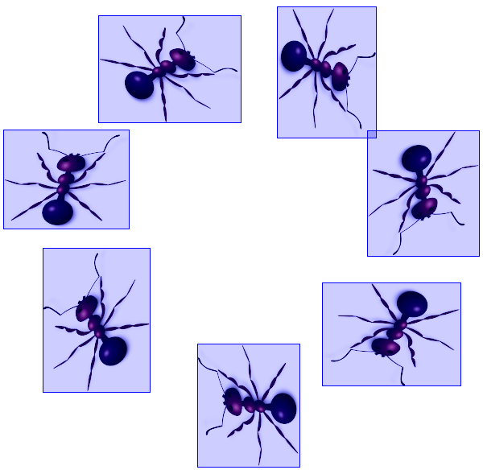 | 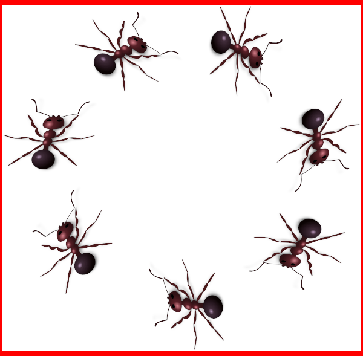

## Segundo bloque de la práctica

El objetivo de este segundo bloque es introducir el funcionamiento de las operaciones morfológicas y las máscaras.  Para ello se implementará el recortado de los elementos de una imagen con un pequeño borde del color de fondo de grosor configurable.

### 6. Determinar la máscara de una imagen

Elaborar la función `get_mask` que recibe dos argumentos: una imagen en color sin transparencia y un color de fondo.  Devuelve una imagen monocroma con un valor de 255 en todos los puntos que no son del color de fondo y 0 en todos aquellos que coinciden con el color de fondo.

```python
>>> get_mask(img, (255,255,255))
```

Original | Con el fondo destacado
---------|-----------------------
 | 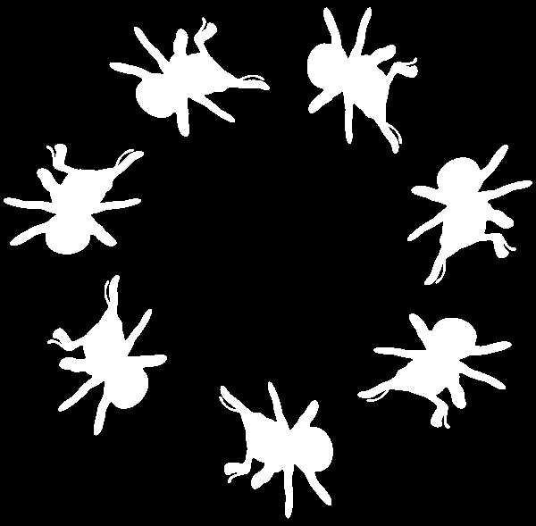


### 7. Aplicación de un elemento estructural

En [esta página](https://es.mathworks.com/help/images/ref/strel.html) puede verse en qué consiste un elemento estructurador morfológico.  Se trata de una imagen binaria (solo los valores 0 y 1 son posibles en cada pixel).

Elaborar la función `strel` que recibe dos argumentos: una cadena de texto y un radio entero.  Debe devolver un elemento estructurador morfológico correspondiente a la cadena de texto según la siguiente tabla:

strel     | forma
----------|---------------------------------------------
`diamond` |  
`square`  |  
`octagon` |  

El radio del elemento estructurador se cuenta en pixels desde el punto central.  Es decir, un elemento estructurador de radio 1 tiene un solo pixel de ancho y alto; un elemento de radio 5 tiene 9 pixels de ancho y alto.  Elabora las formas calculando los puntos que deben ser 1, no a partir de imágenes precalculadas.

**Nota: Fíjate en cómo calcular el octágono de manera completamente similar al `diamond` sin más que añadir un pequeño offset.  El offset puede calcularse teniendo en cuenta que el lado del octágono es $L=2 r \sin(\frac{\pi}{8})$.**

### 8. Operación morfológica ERODE

En [esta página](https://es.mathworks.com/help/images/ref/imerode.html) se describe el funcionamiento de la función `imerode` de Matlab que deberás replicar en este ejercicio.

La función `imerode` recibe como argumentos una imagen monocroma sin transparencia y un elemento estructurador como el generado en el ejercicio anterior.  El resultado devuelto debe ser una imagen del mismo tamaño que la original.  Cada punto de la imagen resultado se calcula centrando el elemento estructurador en el punto de la imagen y calculando el **mínimo** valor de la imagen que cae en un pixel con un 1 del elemento estructurador.

**Nota: Existe una función `imerode` en otra biblioteca externa para Python. No se aceptarán soluciones que simplemente importen la biblioteca mencionada.**

Original | Efecto de `imerode`
---------|-----------------------
 | 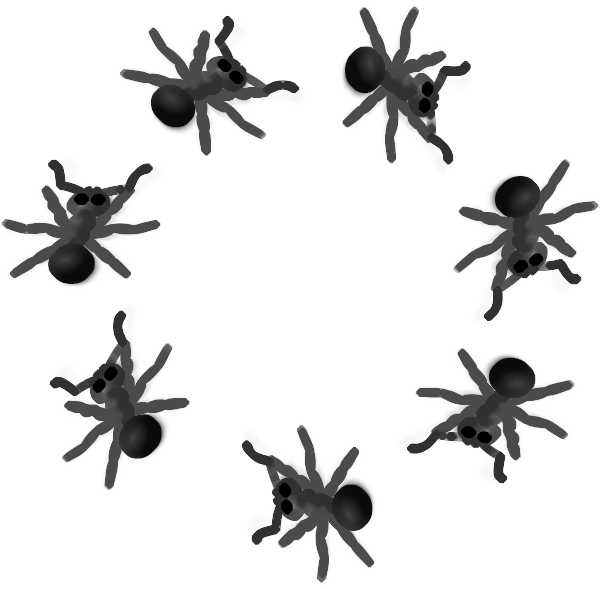


### 9. Operación morfológica DILATE

En [esta página](https://es.mathworks.com/help/images/ref/imdilate.html) se describe el funcionamiento de la función `imdilate` de Matlab que deberás replicar en este ejercicio.

La función `imdilate` recibe los mismos argumentos que en el ejercicio anterior.  El resultado devuelto debe ser una imagen del mismo tamaño que la original.  Cada punto de la imagen resultado se calcula centrando el elemento estructurador en el punto de la imagen y calculando el **máximo** valor de la imagen que cae en un pixel con un 1 del elemento estructurador.

No repliques el código de la función anterior, extrae la parte común en una función de utilidad y usa esta parte común en `imerode` y `imdilate`.

**Nota: Existe una función `imdilate` en otra biblioteca externa para Python. No se aceptarán soluciones que simplemente importen la biblioteca mencionada.**

Original | Efecto de `imdilate`
---------|-----------------------
 | 

### 10. Resalte morfológico de objetos de imagen

El resalte de los contornos de los objetos en una imagen puede realizarse calculando la máscara, aplicando un `imerode` a la máscara, y restando este resultado de la máscara original.  Para un ejemplo, ver por ejemplo la pág. 51 de [este documento](http://eia.udg.es/~rafa/docencia/morfologia.pdf).

Elabora la función `hl_objects` que recibe como argumentos una imagen en color sin transparencia. Primero debe determinar el color de fondo. Posteriormente debe calcular la máscara que corresponde a los objetos, a continuación aplicar `imerode` con un elemento estructural `diamond` de radio 2.  A partir de la máscara y el resultado de la erosión, deberá calcular los bordes, y esos bordes debe plasmarlos en la imagen original en color verde `(0,255,0)`. Devuelve la imagen modificada.

Original | Efecto de `hl_objects`
---------|-----------------------
 | 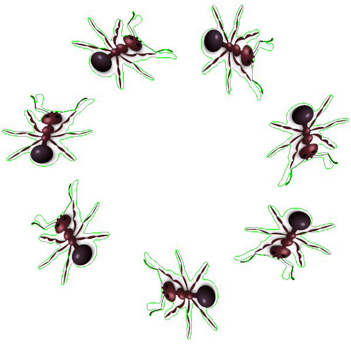

### 11. Auto-recorte de imagen con margen

Elabora la función `autotransp` que recibe como argumentos una imagen sin transparencia y un radio entero.  La función debe calcular la máscara igual que en el ejercicio anterior, aplicar `imdilate` con un elemento estructural octagonal del radio indicado, y usar el resultado para añadir un canal de transparencia a la imagen resultado. Devuelve la imagen modificada.

Original | Efecto de `autotransp`
---------|-----------------------
 | 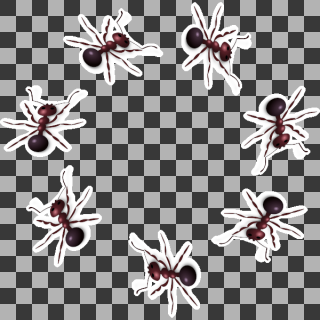

## Pruebas

Como en otras prácticas, las pruebas se implementan usando `pytest`. Sin embargo, ten presente que estas pruebas no están pensadas para depurar tus funciones. Desarrolla tus propias pruebas complementarias.
